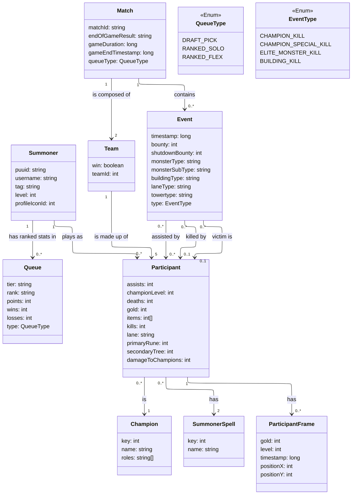

# Data Model — UltimateGGx

This document describes the core entities of UltimateGGx and how they relate to each other.

## Diagram

## Entities

**Summoner** — a Riot account, identified by its `puuid`.

**Queue** — a summoner's ranked standing in a specific queue type. A summoner can have one `Queue` entry per `QueueType` they've played.

**Champion / SummonerSpell** — reference catalogs, not tied to a specific match.

**Match** — a single game, identified by Riot's `matchId`. Holds match-level metadata (duration, end result, queue type).

**Team** — one of the two sides in a match (blue/red).

**Participant** — a summoner's performance within one specific match (kills, gold, items, etc.). Distinct from `Summoner` because the same person plays many matches, each producing its own `Participant` record.

**ParticipantFrame** — a snapshot of a participant's state at a point in time (gold, level, position).

**Event** — a discrete moment in the match (a kill, an objective taken, a tower falling).

## Design notes

- **`Event.killer` / `Event.victim`** are both optional relations to `Participant`, because not every event has a clear killer or victim (e.g. a tower destroyed by minions has neither).

- Fields like `monsterType`, `buildingType`, `laneType` are only populated depending on `Event.type` — for example, `monsterType` is only relevant for `ELITE_MONSTER_KILL` events.